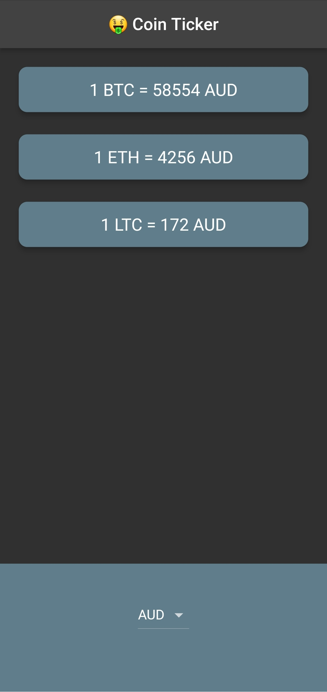
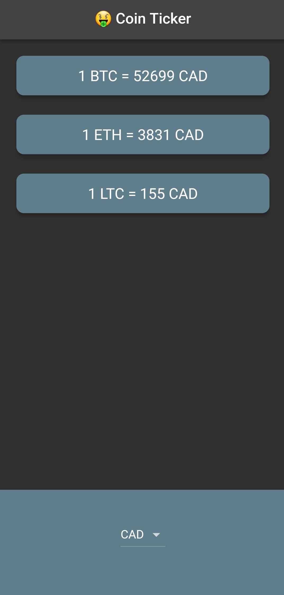

# BitcoinTicker 🤑 - Cupertino widgets and platform-based UI

A crypto currency price checking app. With this app you'll be able to monitor your bitcoin investents on the move!

 

## Lesson goals

- Learn to use the Cupertino package and build Flutter apps for iOS with UIKit styled Cupertino widgets.
- Use the dart:io library to detect runtime platform and create separate UIs for iOS and Android in the same Flutter app.
- Learn to use Dart loops to create recurring widgets.

  

## App Final UI

| | |
| --- | --- |
|  |  |

