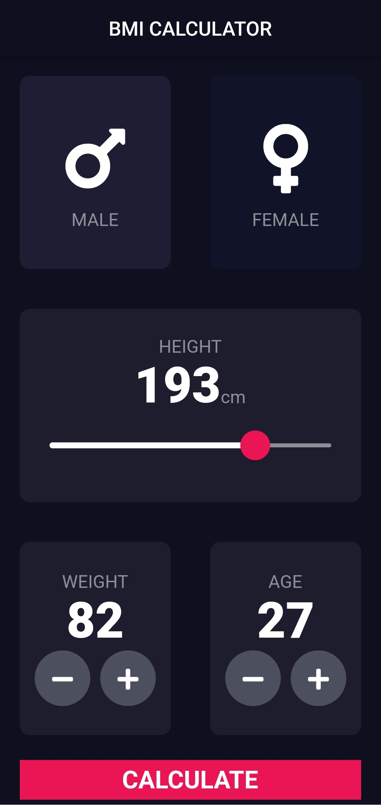
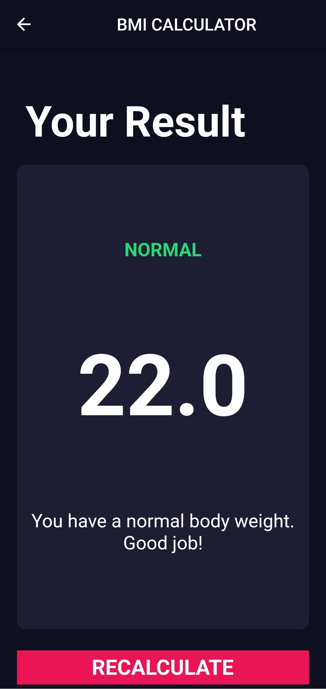
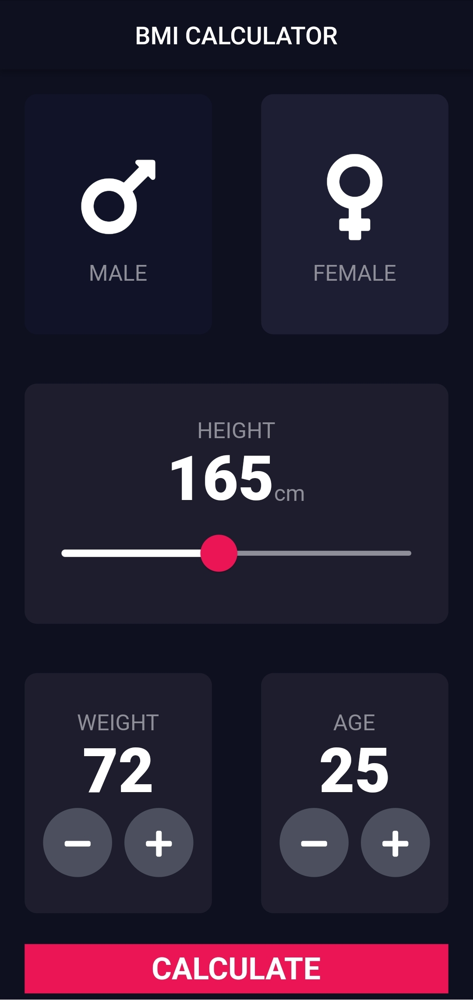
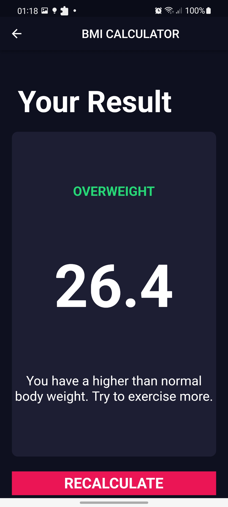
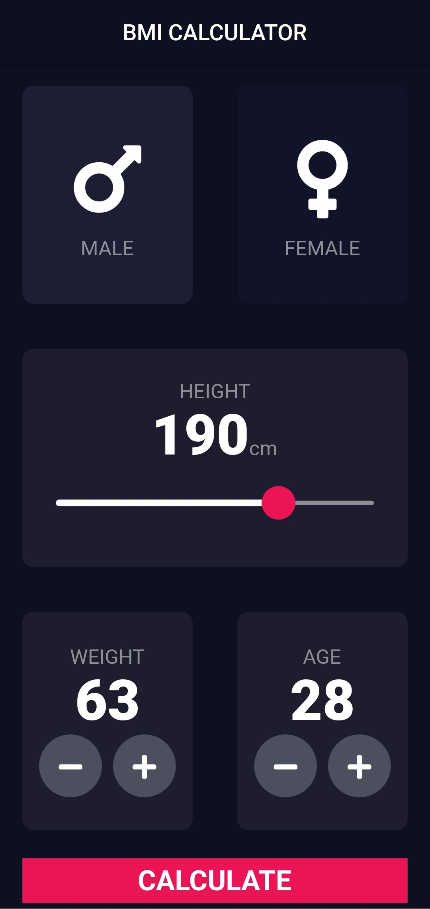
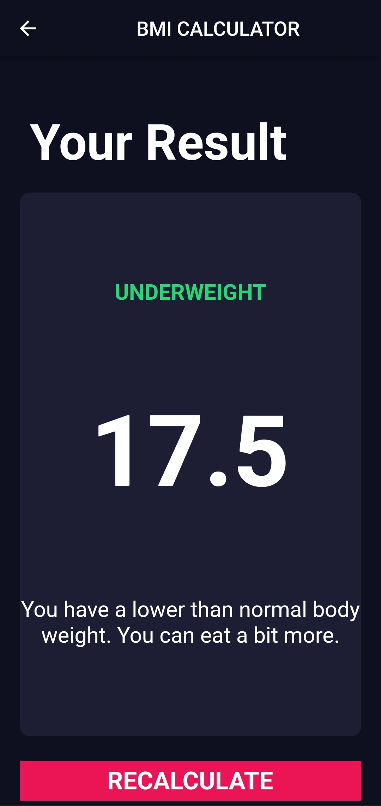

# BMI Calculator 💪 - Building Flutter UIs for Intermediates

Body Mass Index Calculator inspired by the beautiful designs made by Ruben Vaalt. It will be a multi screen app with simple functionality but full-on custom styling.

 

## Lesson goals

- Customise apps with Theme widgets.
- Refactoring widgets by extracting them as separate Widget classes.
- Learn about Dart annotations and modifiers.
- Understand the immutability of Stateless and Stateful Widgets and how the screen is updated with the build() method.
- Create custom Flutter Widgets by combining smaller widgets.
- Learn about the difference between final and const in Dart.
- Learn about maps, enums and the ternary operator in Dart.
- Understand that functions are first class objects in Dart and how functions can be passed around as arguments.
- Learn to build multi-screen Flutter apps by learning about routes and the Navigator widget.
- Understand why flutter favours composition vs. inheritance when customising widgets.

  

## App Final UI

| | |
| --- | --- |
|  |  |
|  |  |
|  |  |

