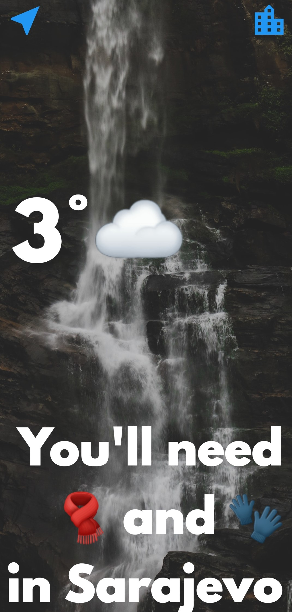
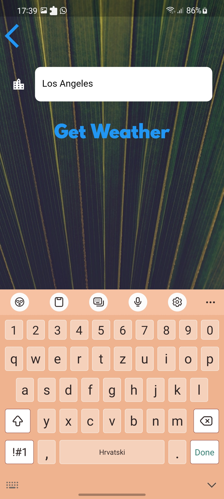
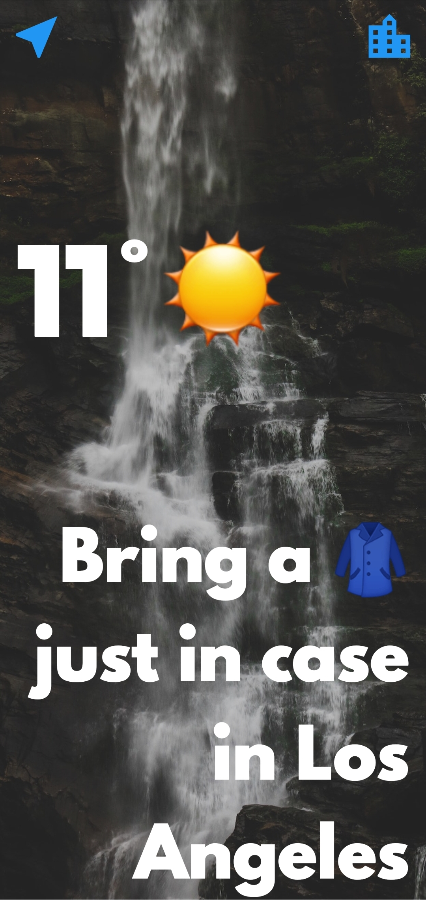

# Clima ☁ - Powering Flutter App with Live Weather Web Data

A weather app inspired by the beautiful designs made by Olia Gozha. With this app you'll be able to find out the live weather data in the current location of the device as well as the weather for any city you can think of!

 

## Lesson goals

- Learn about asynchronous programming in Dart and understand how to use async/await and the Futures API.
- Understand Stateful Widget lifecycle methods.
- Handling exceptions in dart with try/catch and throw.
- Use Dart null aware operators to prevent app crashes.
- Getting location data from both iOS and Android.
- Using the http package to perform networking and get live data from open APIs.
- Understanding how to parse JSON data using the dart:convert library.
- Understand how to pass data to State objects via the Stateful Widget.
- Use the TextField Widget to take user input.
- Understand how to pass data backwards using the Navigator widget.

  

## App Final UI

| | | |
| --- | --- | --- |
|  |  |  |
