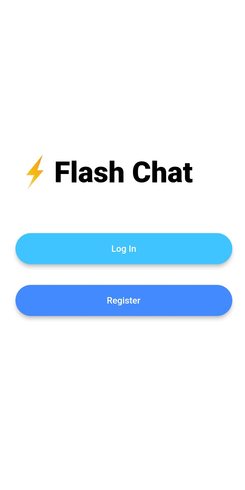
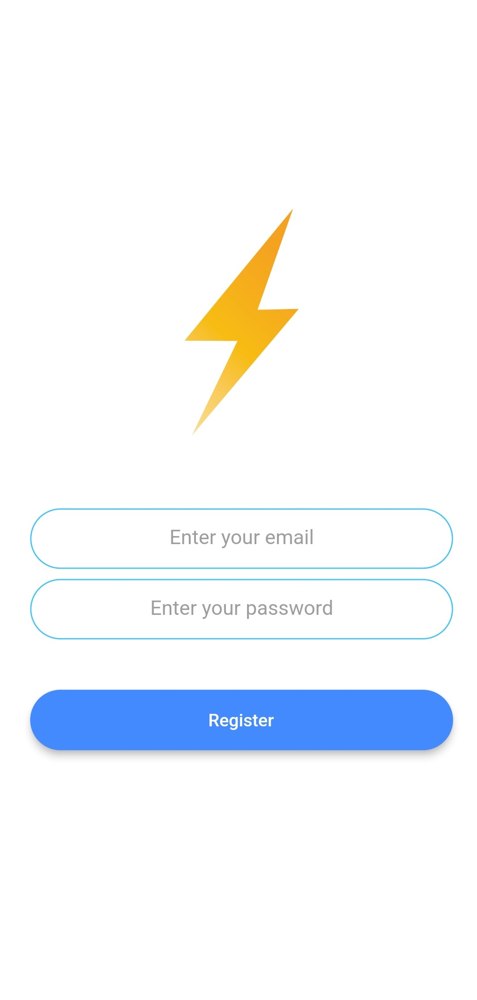
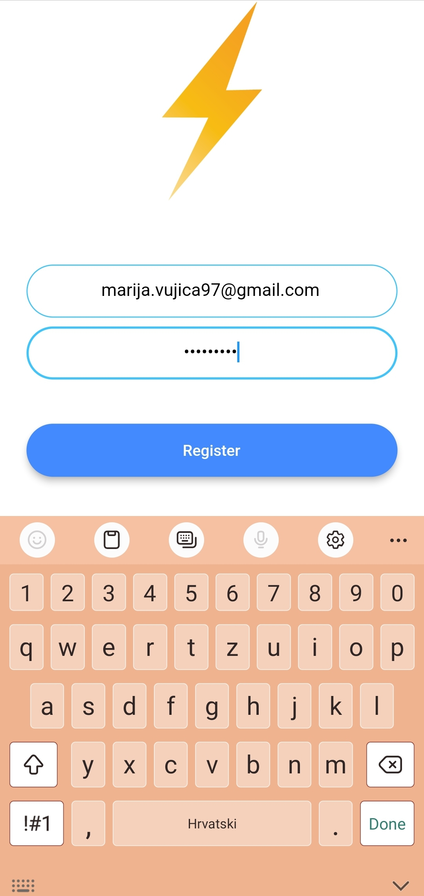
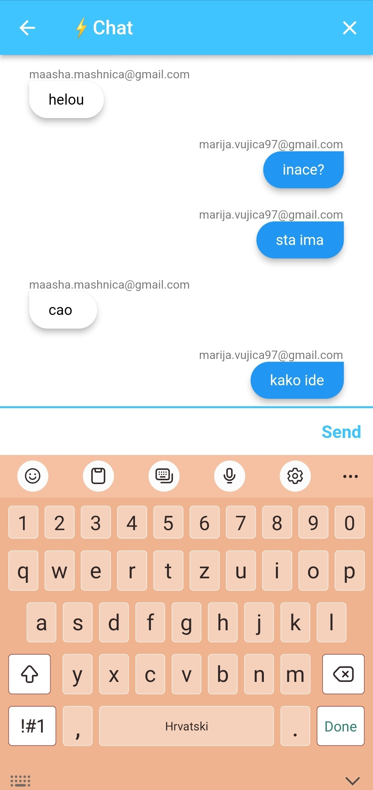

# Flash Chat ⚡️ - Flutter x Firebase Cloud Firestore

A modern messaging app where users can sign up and log in to chat.

 

## Lesson goals

- Learn to use hero animations in Flutter apps.
- Understand how the animation controller works and create custom animations.
- Learn to use Dart mixins to extend class functionality.
- Incorporate Firebase Cloud Firestore into your Flutter apps.
- Implement authentication in your Flutter apps with the Firebase Auth package.
- Build a scrolling ListView widget to learn how Flutter creates and destroys reusable elements.
- Understand Dart Streams to listen to data changes.
- Learn to use the Flutter StreamBuild to turn streams of data into widgets that can be rendered.

  

## App Final UI

| | | | |
| --- | --- | --- | --- |
|  |  |  |  |
