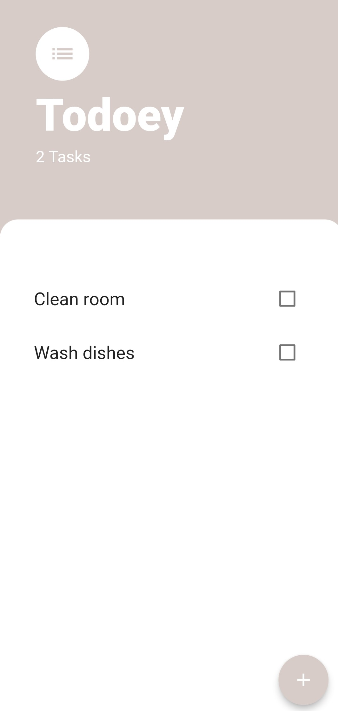
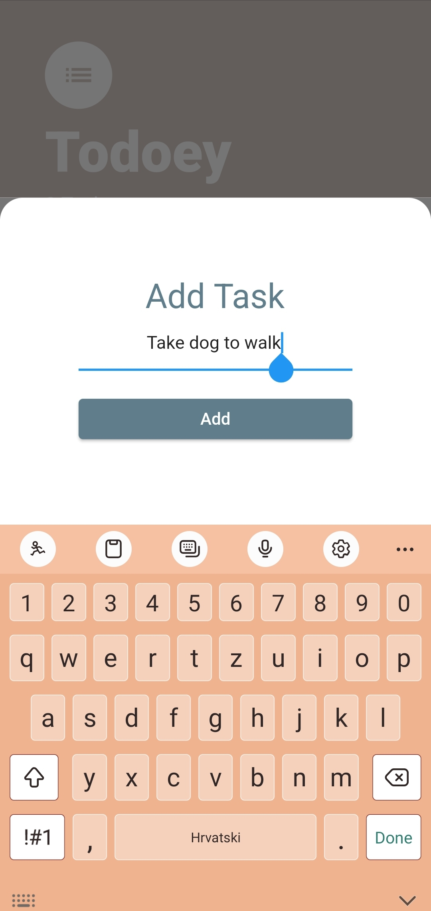
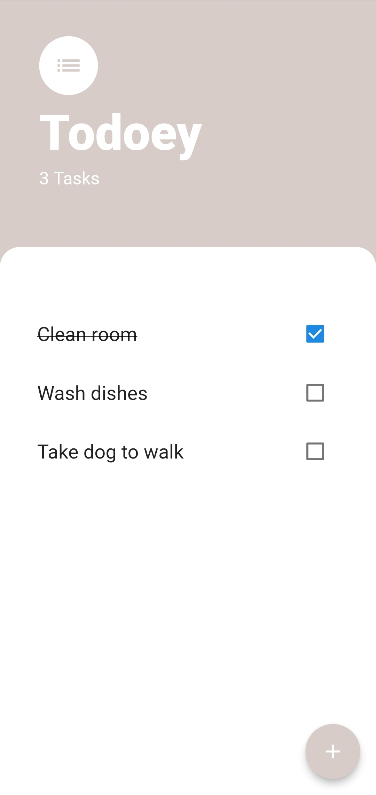
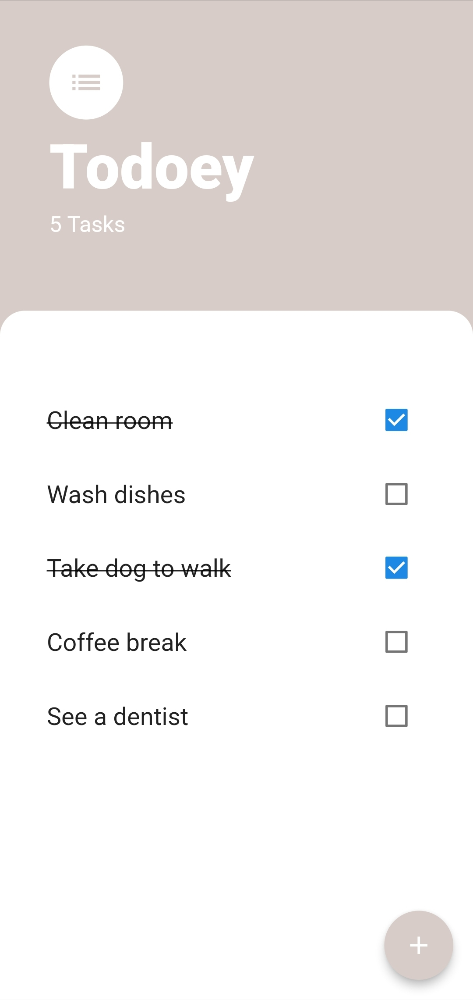

# Todoey ✓ - Flutter State Management

A todolist app to keep track of all your tasks.

 

## Lesson goals

- Understand why we need to manage state across our widget tree.
- Learn about declarative vs. imperative programming.
- Look at how setState works under the hood.
- Learn about prop drilling and lifting state up.
- Create a todo list app.
- Learn about the BottomSheet widget and the ListViewBuilder.
- Understand Flutter app architecture design patterns.
- Learn to manage state with the Google recommended Provider package.

  

## App Final UI

| | | | |
| --- | --- | --- | --- |
|  |  |  |  |
